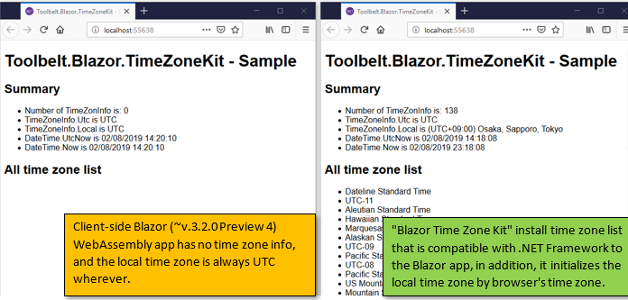

# Toolbelt.Blazor.TimeZoneKit [](https://www.nuget.org/packages/Toolbelt.Blazor.TimeZoneKit/)

## Summary

This is a class library as a NuGet package for [Blazor](https://blazor.net/) browser application.

This package provides system time zones set, and local time zone initialization, for [Blazor](https://blazor.net/) browser application.



### Note

At this time, the version of Blazor is v.0.5.x, it doesn't contain any time zone info, and local time zone is always UTC wherever.

See also: 

- [Blazor Issue #663 - TimeZone issues related to Mono?](https://github.com/aspnet/Blazor/issues/663)
- [Blazor Issue #1166 - DateTime always displays as UTC](https://github.com/aspnet/Blazor/issues/1166)
- [Mono Issue #6368 - WebAssembly: Missing Timezone implementation](https://github.com/mono/mono/issues/6368)

## How to install and use it?

**Step.1** - Install this package.

```shell
> dotnet add package Toolbelt.Blazor.TimeZoneKit
```

**Step.2** - call `UseLocalTimeZone()` extension method  in `Configure()` method of startup class.

```csharp
...
using Toolbelt.Blazor.Extensions.DependencyInjection;

public class Startup
{
    ...
    public void Configure(IBlazorApplicationBuilder app)
    {
        app.UseLocalTimeZone();
    ...
```

That's all!

## How does it work?

There is no magic.

This library contains all the system time zone information as a C# code.  
(see: ["TimeZoneKit.CreateSystemTimeZones.cs"](https://github.com/jsakamoto/Toolbelt.Blazor.TimeZoneKit/blob/master/Toolbelt.Blazor.TimeZoneKit/TimeZoneKit.CreateSystemTimeZones.cs#L16))

And, this library also contains mapping information for converting IANA time zone names to .NET time zone IDs.  
(see: ["TimeZoneKit.IANAtoTZIdMap.cs"](https://github.com/jsakamoto/Toolbelt.Blazor.TimeZoneKit/blob/master/Toolbelt.Blazor.TimeZoneKit/TimeZoneKit.IANAtoTZIdMap.cs#L5))

`UseLocalTimeZone()` extension method in this library invokes `"Intl.DateTimeFormat().resolvedOptions().timeZone"` JavaScript code to get the current time zone name (IANA name) on the web browser.

`UseLocalTimeZone()` extension method also set up the system time zone set and local time zone information by accessing undocumented / non public members in `System.TimeZoneInfo` class.

### Note

- **WARNING** - This library accesses private members of `System.TimeZoneInfo` using the "Reflection" .NET API, so it may break in future .NET runtime (mono.wasm) release.
- In my test case, this package increased the size of the sample Blazor browser application content by 154 KB. (by 20KB gzip transfer.)

## License

[Mozilla Public License Version 2.0](LICENSE)
